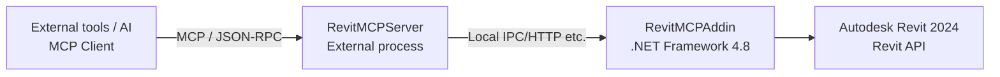

# RevitMCP Server / Revit MCP Toolkit

> An open integration platform (server + add-in) to safely operate Autodesk RevitR 2024 from external tools (including AI agents).  
> It is explicitly designed to be usable in Japanese, so workflows can align with local practice and regulations (e.g., building codes, internal standards, and guidelines).

---

## First steps

- ? Quick path (connection check / basic operations): `Codex/START_HERE.md`
- ? Utilities to check/stop the server: `Tools/README.md`
- ? Japanese version: `README.md`

---

## Why it matters (value)

- **A unified entry point to operate Revit from external tools** (AI/CLI/other tools)
- **Safe execution on the Revit side via an add-in** (Revit API operations)
- **Easy to extend for your operational rules** (internal standards, templates, parameter schemas)
- **Japanese-first design** for local workflows and terminology

---

## What it can do (use cases)

> We turned as much as possible of what is achievable via the Revit API into commands.  
> Have an AI agent read the manuals and ask it what you want to do.

Example use-case patterns:

- **Model understanding**
  - Collect and summarize current view / selection info
  - Extract findings (warnings, missing parameters) into reports
- **Batch cleanup**
  - Normalize parameters, naming, template application, and attributes
- **Drafting / creation assistance**
  - Create, place, align, and tag elements under constraints (depends on command coverage)
- **Tool integrations**
  - Integrate with Excel / Rhino / AutoCAD under the same concept (related components may exist in this repo)

---

## Quick Start (shortest path)

1. Follow `Codex/START_HERE.md` to **check the connection** (shortest path)
2. Install required runtimes (see "Runtime Requirements")
3. Start the server (local recommended)
4. Connect from an MCP client (AI/CLI/tool) and run commands

---

## Architecture Overview (high level)

- **External server process**: entry point for MCP / JSON-RPC requests from clients.
- **Revit add-in (.NET Framework 4.8)**: executes operations via the Revit API.
- **Transport**: local IPC/HTTP/etc. (depends on implementation)
- **Extensible**: add commands; adapt to internal standards, templates, and parameter schemas.

---

## Repository Layout (map)

This repository centers on Revit MCP and can host related components under the same concept.

- `RevitMCPServer`: server process
- `RevitMCPAddin`: Revit add-in
- `RevitMCP.Abstractions`: shared interfaces / common parts
- `McpRevitBridge`: bridge components (role TBD)
- `Codex`: Codex onboarding/tools
- `tools`: utilities to check/stop the server
- `ExcelMCP` / `RhinoMCP` / `AutoCadMCP`: related MCPs (if present; see their docs)

---

## Runtime Requirements

- **.NET 8 Runtime** (e.g., `RevitMCPServer` / `ExcelMCP` / `RhinoMcpServer` / `AutoCadMcpServer`)
- **.NET 6 Runtime** (`Codex/CodexGui`)
- **.NET Framework 4.8** (`RevitMCPAddin` / `RhinoMcpPlugin`)

---

## Security & Operational Notes (important)

- This project provides powerful automation. Operate it under the **principle of least privilege**.
- In shared environments, consider authentication, access control, and audit logs per your policy.
- When using generative AI, plan for mis-operations and hallucinations, for example:
  - dry-run / confirm flows
  - change diff previews
  - extra confirmation for critical actions

---

## Important Notices (Disclaimer & Requirements)

- This project is released under Apache License 2.0 (see `LICENSE`).
- This project is not affiliated with, endorsed by, or sponsored by Autodesk, Inc.
- This repo does not ship or redistribute Autodesk materials (Revit binaries, SDK, DLL/CHM/sample files). A valid Autodesk RevitR license is required.
- Provided AS IS. The authors are not liable for any damages (see `LICENSE`).

---

## Support & Questions

- Questions and bug reports: GitHub Issues
- Discussions: GitHub Discussions
- We do not publish email contact. See `SUPPORT.md` for support policy.

---

## Contributing

Pull requests are welcome. See `CONTRIBUTING.md`.

---

## Legal / IP / Confusion Avoidance (Risk Mitigation)

### Independent Implementation
This project is independently implemented using the official Autodesk Revit API.  
It does not copy, decompile, reverse-engineer, or incorporate proprietary code from other products/services.

### Trademarks
- Codex is a product of OpenAI.
- AutodeskR and RevitR are trademarks or registered trademarks of Autodesk, Inc.
- Please avoid names, logos, or descriptions that could cause confusion with third-party brands.

### Patents (Apache 2.0)
- Apache License 2.0 includes a patent license from contributors for their contributions.
- This does not eliminate third-party patent risks. Consult legal counsel if needed.

---

## Distribution Policy (Binaries)

This repository is published primarily as **source code**.  
If your organization builds and distributes binaries internally, ensure compliance with Autodesk licensing terms and your development tool licensing (e.g., Visual Studio).

---

## Credits

Created by Tetsuya Okuno and GPT series (2025) / 99.9% vibe coding

---

## License

Apache License 2.0 (see `LICENSE`)
