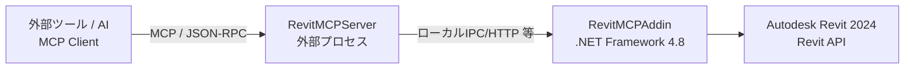

# RevitMCP Server / Revit MCP Toolkit

> Autodesk RevitR 2024 を、外部ツール（AIエージェントを含む）から **安全に操作・連携** するための、オープンな統合基盤（**サーバー＋アドイン**）です。  
> **日本語で使えること**を明確な目的として設計し、国内の設計実務フローや日本独自の基準・法規（例：建築基準法、社内標準、各種ガイドライン）に沿った運用設計をしやすくすることを狙っています。

---

## まず最初に

- ? 最短導線（接続確認?基本操作）: `Codex/START_HERE.md`
- ? サーバーの確認・停止などユーティリティ: `Tools/README.md`
- ? 英語版: `README.en.md`

---

## 何が嬉しいのか（このプロジェクトの価値）

- **Revit を外部から“操作できる”統合口**を用意（AI/CLI/別ツールから叩ける）
- **Revit 側はアドインで安全に実処理**（Revit API による操作）
- **運用（社内標準・テンプレ・パラメータ体系）に合わせて拡張しやすい**
- **日本語前提**で、現場の言葉のまま運用設計しやすい

---

## できること（想定ユースケース）

> Revit APIで可能なことをできるだけコマンド化しました。  
> マニュアルをAIエージェントに読ませて尋ねて下さい。

例（ユースケースの“型”）:

- **モデルの状態把握**
  - 現在ビュー／選択要素の情報を収集して要約
  - 指摘事項（警告、未設定パラメータ等）を抽出してレポート化
- **一括整備**
  - パラメータの整合、命名の統一、テンプレ適用、属性の付与
- **作図・作成支援**
  - 条件に沿った要素作成、配置、整列、タグ付け（※コマンド実装に依存）
- **周辺ツール連携**
  - Excel / Rhino / AutoCAD と同一構想で連携（本リポジトリ内に関連コンポーネントが存在し得る）

---

## デモ（ここが刺さる：1枚でわかる）

- `assets/` などに画像を置いて README から参照するのがおすすめ

---

## クイックスタート（最短で動く導線）

1. `Codex/START_HERE.md` に沿って **接続確認**（最短導線）
2. 依存ランタイムをインストール（下記「実行に必要なもの」参照）
3. サーバーを起動（ローカル推奨）
4. MCP対応クライアント（AI/CLI/ツール）から接続してコマンド実行

---

## アーキテクチャ概要（ざっくり理解）

- **外部プロセスのサーバー**: MCP / JSON-RPC の入口。AI/CLI/他ツールからのリクエストを受け付けます。
- **Revit アドイン（.NET Framework 4.8）**: Revit API を用いて実処理を実行します。
- **通信**: ローカルIPC/HTTP等（実装に依存）
- **拡張**: コマンド単位で追加可能。社内標準・テンプレ・パラメータ体系に合わせて拡張します。

---

## リポジトリ構成（ざっくり地図）

このリポジトリは Revit 向け MCP を中心に扱いつつ、同一構想で周辺も置ける構成になっています。

- `RevitMCPServer` : サーバー本体（外部プロセス）
- `RevitMCPAddin` : Revit アドイン
- `RevitMCP.Abstractions` : 共有インターフェース/共通部品
- `McpRevitBridge` : ブリッジ関連（役割は要確認）
- `Codex` : Codex 向け導線/ツール群
- `tools` : サーバー確認・停止などのユーティリティ
- `ExcelMCP` / `RhinoMCP` / `AutoCadMCP` : 関連MCP（存在し得る／運用は各ドキュメントに従う）

---

## 実行に必要なもの（ランタイム）

- **.NET 8 Runtime**（例：`RevitMCPServer` / `ExcelMCP` / `RhinoMcpServer` / `AutoCadMcpServer`）
- **.NET 6 Runtime**（`Codex/CodexGui`）
- **.NET Framework 4.8**（`RevitMCPAddin` / `RhinoMcpPlugin`）

---

## セキュリティと運用上の注意（重要）

- 本プロジェクトは Revit への強力な操作権限を提供します。**最小権限の原則**で運用してください。
- 共有環境では、認証・アクセス制御・監査ログなど、組織ポリシーに基づく対策を推奨します。
- 生成AIを介する場合は、誤操作・誤解釈・ハルシネーションによる操作を想定し、例えば以下を検討してください:
  - dry-run / confirm フロー
  - 変更差分の提示
  - 重要操作の二重確認

---

## 重要（免責・前提）

- 本プロジェクトは Apache License 2.0 に基づき提供されます（詳細は `LICENSE`）。
- 本プロジェクトは Autodesk, Inc. と提携・承認・保証関係にありません。
- 本プロジェクトは Revit 本体・Revit SDK・Autodesk の配布物（DLL/CHM/サンプル等）を同梱・再配布しません。利用には正規ライセンスの Autodesk RevitR が必要です。
- 無保証（AS IS）で提供されます。業務・成果物・法規適合・損害等について提供者は責任を負いません（`LICENSE` を参照）。

---

## サポート・質問

- 質問・不具合報告: GitHub Issues
- 相談・議論: GitHub Discussions
- メール等の個別連絡先は公開しません。対応方針は `SUPPORT.md` を参照してください。

---

## コントリビュート

Pull Request 歓迎です。手順は `CONTRIBUTING.md` を参照してください。

---

## 法務・権利・混同回避（リスクヘッジ）

### 独立実装について
本プロジェクトは、公式に提供される Autodesk Revit API を利用して独自に実装されています。  
他社製品・サービスのコードや内部実装をコピー／逆コンパイル／リバースエンジニアリングしていません。

### 商標・表記
- Codex は OpenAI の製品です。
- AutodeskR、RevitR は Autodesk, Inc. の商標または登録商標です。
- 本プロジェクト名・ロゴ・説明は、第三者の商標やブランドと混同しないよう配慮してください。

### 特許について（Apache 2.0）
- Apache License 2.0 は、コントリビュータが保有する関連特許について一定の利用許諾を含みます。
- ただし第三者（本プロジェクト外）の特許リスクをゼロにするものではありません。必要に応じて社内法務で確認してください。

---

## 配布方針（実行形式について）

本リポジトリは **ソースコード中心**で公開します。  
組織内で実行形式（DLL/EXE）を配布する場合は、Autodesk および開発ツール（例：Visual Studio）のライセンス条件を各組織で確認してください。

---

## クレジット

Created by RevitMCP Contributors (2025) / 99.9％バイブコーディング

---

## ライセンス

Apache License 2.0（`LICENSE` を参照）
